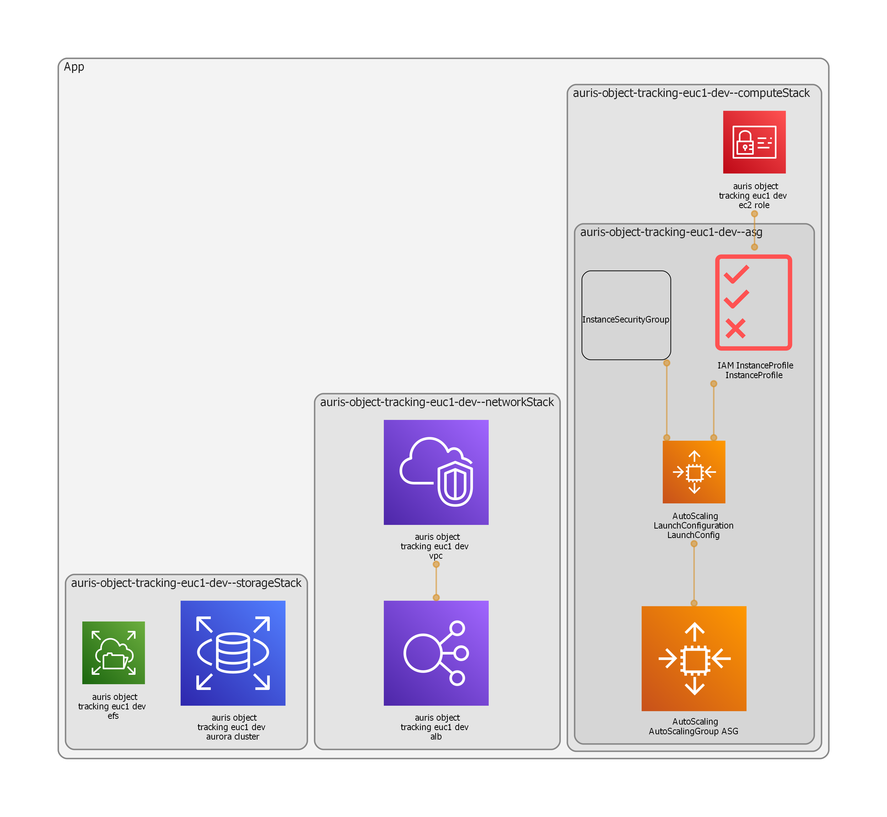

# Welcome to my first Cloud Development Kit project with CDK!

This is a simple application to deploy instances in autoscaling group
behind a Load Balancer, which have access to Aurora MySQL database and a 
shared filesystem through EFS

The `cdk.json` file tells the CDK Toolkit how to execute your app and has the environment
settings [Currently only dev].

## Useful commands

 * `npm run build`   compile typescript to js
 * `npm run watch`   watch for changes and compile
 * `npm run test`    perform the jest unit tests
 * `cdk deploy`      deploy this stack to your default AWS account/region
 * `cdk diff`        compare deployed stack with current state
 * `cdk synth`       emits the synthesized CloudFormation template
 * `cdk deploy -c config=dev` will deploy the infrastructure using the dev environment configurations

